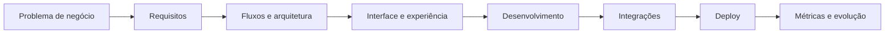

<!--
README.md otimizado para o perfil GitHub de Matheus Mendes
Repositório correto: github.com/matheusmendescc/matheusmendescc
-->

<div align="center">

  

  <a href="https://git.io/typing-svg">
    
  </a>

  <br />

  <a href="mailto:matheusmcc.dev@gmail.com">
    
  </a>
  <a href="https://www.linkedin.com/in/matheusmendescc/">
    
  </a>
  <a href="https://matheusmendes.cc/">
    
  </a>
  <a href="https://mytrus.com.br/">
    
  </a>

</div>

---

## 👋 Sobre mim

Sou **Matheus Mendes Castro Cavalcante**, desenvolvedor web e analista de sistemas com formação em **Ciência da Computação** e pós-graduação em **Inteligência Artificial Aplicada ao Growth Marketing**.

Atuo na criação de **aplicações web, sistemas internos, dashboards, CRM, produtos SaaS, integrações, automações, landing pages de conversão e aplicativos mobile**.

Minha atuação combina:

- desenvolvimento web;
- produto digital;
- UX/UI;
- operações SaaS;
- automação de processos;
- IA aplicada ao desenvolvimento;
- visão de negócio.

Tenho experiência construindo soluções digitais do levantamento de requisitos até a entrega, utilizando ferramentas modernas como **React, Next.js, TypeScript, Node.js, Python, Supabase, Stripe, APIs REST, Vercel, Railway, Cursor, Google Antigravity, Claude Code e Codex**.

> Muitos projetos comerciais estão em repositórios privados por envolverem clientes, empresas e sistemas internos. Neste perfil, apresento stacks, cases, demos e projetos públicos sempre que possível.

---

## 🚀 Destaques rápidos

<div align="center">

| Indicador | Resultado |
|---|---:|
| Projetos e páginas digitais desenvolvidas | **80+** |
| Projetos publicados em produção | **50+** |
| Leads recebidos em ecossistema próprio | **500+** |
| Sistemas e produtos digitais com participação direta | **10–15** |
| Landing pages em Next.js para campanhas | **5** |
| MVP SaaS validado por usuários reais | **25 usuários** |
| App mobile publicado iOS e Android | **100+ downloads iniciais** |
| Clientes recorrentes em operação SaaS | **5 ativos** |

</div>

---

## 🧠 Áreas em que atuo

```txt
Desenvolvimento Web
Aplicações Internas
Dashboards
CRM
SaaS
APIs REST
Integrações
Automações
Landing Pages
Apps Mobile
Produto Digital
UX/UI
AI-Assisted Development
```

---

## 🛠️ Tech Stack

### Front-end

<div align="left">
  
</div>

<br />


### Back-end, dados e integrações

<div align="left">
  
</div>

<br />


### Mobile

<div align="left">
  
</div>

<br />


### Deploy, CMS, analytics e ferramentas

<div align="left">
  
</div>

<br />


### IA aplicada ao desenvolvimento


---

## 💼 Projetos em destaque

<table>
  <tr>
    <td width="50%" valign="top" align="center">


### Mytrus CRM & SaaS Operations Platform
Sistema interno para gestão de leads, clientes, projetos, pagamentos, assinaturas e métricas SaaS.

**500+ leads · 5 clientes recorrentes · operação centralizada**

`React` `Next.js` `TypeScript` `Node.js` `Supabase` `Stripe`

</td>
    <td width="50%" valign="top" align="center">


### GeraProfit — SaaS de FP&A
MVP SaaS para gestão financeira, modelagem financeira e tomada de decisão.

**25 usuários validados · menos planilhas · novo canal de faturamento**

`React` `TypeScript` `Next.js` `API do ChatGPT`

</td>
  </tr>
  <tr>
    <td colspan="2" valign="top" align="center">


### Hidra Pure — App Meu Dia & Landing Pages
Aplicativo mobile e landing pages de conversão para hidratação, experiência digital, SEO, performance e campanhas.

**iOS + Android · 100+ downloads · 5 páginas · GA4 + Pixel · conversão e vendas**

`React Native` `Supabase` `Next.js` `React` `TypeScript` `SEO` `GA4` `Push Notifications`

</td>
  </tr>
</table>
---

## 📈 GitHub Analytics

<div align="center">

  

  

</div>

<div align="center">

  

</div>

> Observação: muitos projetos comerciais estão em repositórios privados, então os gráficos públicos podem não representar toda a experiência prática.

---

## 📊 Atividade

<div align="center">

  

</div>

---

## 🧭 Como eu penso produto e tecnologia



Gosto de construir soluções que não sejam apenas bonitas ou tecnicamente funcionais, mas que resolvam problemas reais de operação, aquisição, gestão e tomada de decisão.

---

## 🧰 Stack por tipo de solução

| Tipo de solução | Tecnologias e ferramentas |
|---|---|
| Aplicações internas | React, Next.js, TypeScript, Supabase, Node.js |
| Dashboards | React, Next.js, Supabase, SQL, métricas SaaS |
| Integrações | APIs REST, Stripe, Google Sheets, Monday.com, Omie |
| Landing pages | Next.js, SEO, GA4, Pixel, performance web |
| Mobile | React Native, Supabase, notificações push |
| IA aplicada | Cursor, Google Antigravity, Claude Code, Codex, Replit |
| Produto e operação | CRM, MRR, LTV, Churn, Forecast, NPS |

---

## 🎓 Formação

**Ciência da Computação**  
Centro Universitário de João Pessoa — UNIPÊ  
Concluído em 2025.1

**Pós-Graduação em Inteligência Artificial Aplicada ao Growth Marketing**  
Centro Universitário União das Américas / Descomplica  
Concluída em 2025.2

---

## 🏅 Microcertificados

- A Inteligência Artificial como Habilidade no Mercado de Trabalho — 30h
- Análise de Dados e BI para Tomada de Decisão — 30h
- Branded Content: Marketing de Conteúdo — 30h
- Content Development — 30h
- Growth Hacking — 30h
- Jornada do Consumidor — 30h
- Martech — 30h
- Social Media — 30h

---

## 🌐 Onde me encontrar

<div align="center">

  <a href="mailto:matheusmcc.dev@gmail.com">
    
  </a>
  <a href="https://www.linkedin.com/in/matheusmendescc/">
    
  </a>
  <a href="https://matheusmendes.cc/">
    
  </a>
  <a href="https://mytrus.com.br/">
    
  </a>

</div>

---

<div align="center">

  

</div>

<div align="center">

  <sub>
    Construindo produtos digitais, sistemas internos e experiências web orientadas a negócio.
  </sub>

</div>


